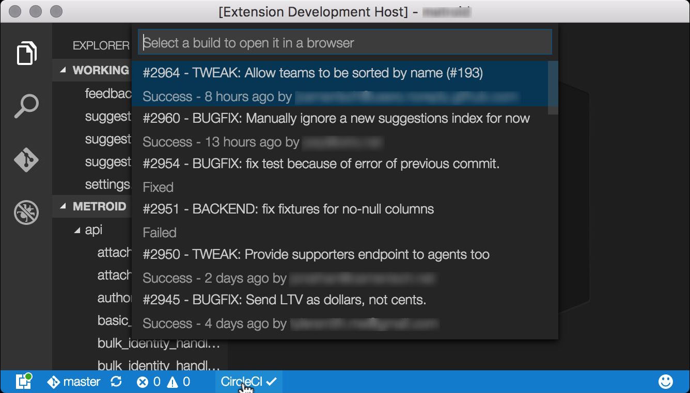

# CircleCI extension for Visual Studio Code

## Features

* Status bar status of latest build for branch
* History of statuses for previous builds for current branch
* Open builds in browser

## Configuring

This extension will run if you have a `circle.yml` file in your project root.

Create an API token in your [CircleCI dashboard](https://circleci.com/account/api) and add it to your workspace configuration file (make sure you select the "Build Artifacts" or "All" scope option). Keys from the repo settings page will not work.

**Settings:**
`circleci.apiKey`: _String_. API key you create in your [CircleCI dashboard](https://circleci.com/account/api). Scope must be set to either "Build Artifacts" or "All".
`circleci.rate`: _Number_. How often this extension will refresh status for the current branch. In seconds. Default: 10.

## Upcoming

Please let me know what other features you'd like to see. Here are some of my ideas.
Would these be valuable to you?

- Cancel one/all builds on branch
- Notifications for branch failures, fixes, etc.
- Download build artifacts
- See what's in the queue
- circle.yml help and syntax

## Contributing

Please do. I'm also just interested in features you'd like to see.

**Enjoy!**
